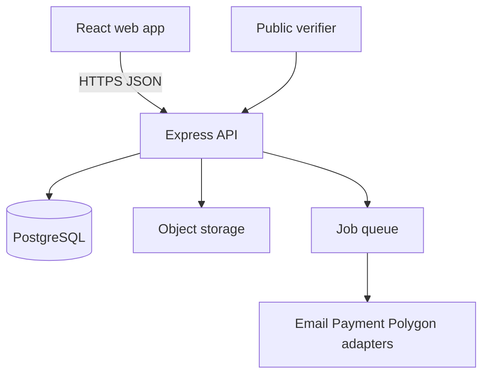

# System Architecture

## Architecture decision

Use a **modular monolith** with a React SPA and one Node.js/Express API backed by PostgreSQL. This is the first backend framework to configure and the only application backend for MVP. It matches the existing repository and reduces five-week integration risk. Do not add FastAPI merely for AI; introduce a Python worker later only through an ADR when a measured workload requires it.

## Runtime topology

The API is the trust boundary. Browsers never connect directly to privileged database, payment, email, or wallet credentials.

## Backend modules

- `identity`: accounts, verification, sessions, password reset.
- `organizations`: seller tenants, memberships, invitations, permissions.
- `catalog`: listings, media, price tiers, search.
- `requirements`: buyer demand and rules-based matching.
- `pools`: group-buy state, reservations, dynamic pricing.
- `orders`: lifecycle, fulfilment, returns and disputes.
- `payments`: provider adapter, attempts, callbacks, refunds, ledger.
- `trust`: messaging, reviews and moderation.
- `passports`: canonical snapshots, hashing, anchoring and verification.
- `impact`: auditable aggregates.
- `admin`: platform operations using the same services and policies.
- `notifications`: email/in-app jobs.
- `audit`: append-only privileged and security events.

Modules expose service interfaces; routes call services, services own transactions and policy, repositories own persistence, adapters isolate vendors. No module reads another module's tables from controller code.

## Frontend architecture and portals

Use one React application, one identity, one design system, and routed workspaces:

| Route area            | Audience                   | Pattern                             |
| --------------------- | -------------------------- | ----------------------------------- |
| `/marketplace/*`      | Public/buyers              | discovery and purchase flows        |
| `/account/*`          | Any signed-in user         | profile, security, sessions         |
| `/buyer/*`            | Buyer                      | requirements, contributions, orders |
| `/org/:orgSlug/*`     | Seller organization member | listings, orders, team, analytics   |
| `/admin/*`            | Platform staff             | moderation and operations           |
| `/verify/:passportId` | Public                     | privacy-safe verification           |

This is not one giant dashboard page and not three separately deployed portals. Route layouts provide role-specific navigation. API permissions remain authoritative.

## Dashboards and analytics

There are five role-aware dashboard home views, inside one deployed web app:

| Dashboard          | Principal            | Decision it supports                                                    |
| ------------------ | -------------------- | ----------------------------------------------------------------------- |
| Buyer              | Small business/user  | What to buy, group status, payments and procurement history             |
| Seller Owner / CEO | Organization owner   | Revenue recovery, inventory exposure, conversion, fulfilment and impact |
| Seller Manager     | Operational manager  | Team workload, listing/pool/order queues and exceptions                 |
| Seller Staff       | Approved employee    | Assigned work, stock and permitted order/listing actions                |
| Platform Admin     | ReSource PK operator | Marketplace safety, health, disputes, moderation and failures           |

Analytics is generated from transactionally consistent operational tables plus read models/materialized aggregates. It is not calculated in the browser from partial pages. An analytics/export service applies the same policy check as the dashboard, then creates CSV/PDF exports asynchronously and records the export in audit logs.

## Authorization model

Use permission-based RBAC scoped by organization.

- Platform roles: `platform_admin`, `platform_support`, `platform_auditor`.
- Organization roles: `owner`, `org_admin`, `manager`, `staff`.
- Buyer is an account capability, not permission to manage an organization.
- Owners can delegate through expiring email invitations.
- Managers can delegate only permissions explicitly granted to them and only below their role boundary.
- One user may switch between buyer context and multiple organization contexts.
- Emergency production access is outside normal UI roles, time-bound, approved, and logged.

## State and consistency

- PostgreSQL transactions and row locks protect inventory and pool joins.
- Unique constraints enforce idempotency keys, provider references, invitation nonces and passport versions.
- An outbox table records work that must occur after commit. A worker processes email, notifications and blockchain anchoring with retries.
- Cache is optional and never the source of truth.
- API errors follow one envelope: `{ code, message, details?, correlationId }`.
- OpenAPI is versioned; breaking changes require `/api/v2` or coordinated migration.

## Security zones

- Public: browse and passport verification with strict rate limits.
- Authenticated: buyer and member operations.
- Organization-scoped: every resource checked against active membership and permission.
- Platform operations: separate permission set, step-up authentication for destructive/sensitive actions.
- Provider callbacks: signature verification, allowlisting when reliable, replay protection and raw-body preservation where required.

## Deployment

- Frontend: Vercel or equivalent static hosting/CDN.
- API: Vercel Node Functions for the MVP; introduce a continuously running worker only when queued jobs require it.
- Data: managed PostgreSQL; object storage for uploads.
- Environments: local, preview/staging, production with separate credentials and databases.
- CI: install from lockfile, lint, unit/integration tests, build, migration check, secret/dependency scan.
- Deploy: backward-compatible migration, API/worker, smoke tests, then frontend. Production rollback never rewrites migration history.

## Transactional email

Phase 1 uses a provider adapter implemented with Nodemailer and Gmail SMTP. Only the backend reads `GMAIL_USER` and `GMAIL_APP_PASSWORD`; the app password is created with Google two-step verification and is never committed, logged, returned to the browser, or stored in PostgreSQL. Verification links expire after 24 hours and password-reset links after one hour. Tokens are random, single-use, and stored only as SHA-256 hashes. Each delivery has an idempotent event key and a status record so a provider change does not affect identity logic. A later production domain can replace Gmail by changing the adapter, without changing auth services or API contracts.

## Observability and recovery

Structured JSON logs include timestamp, level, correlation ID, actor ID (when safe), route, latency and error code. Never log passwords, tokens, payment secrets or private keys. Track auth failures, callback verification failures, job retries, pool conflicts and anchor backlog. Provide `/health` and `/ready`. Managed backups are enabled; restore is rehearsed before final release.

## Blockchain boundary

PostgreSQL remains authoritative. The contract stores `orderId/passportId -> bytes32 hash` with an authorized writer and first-write protection for version 1. Corrections are linked versions/events, never silent overwrites. Anchoring proves later tamper evidence only, not truth of initial physical data.
